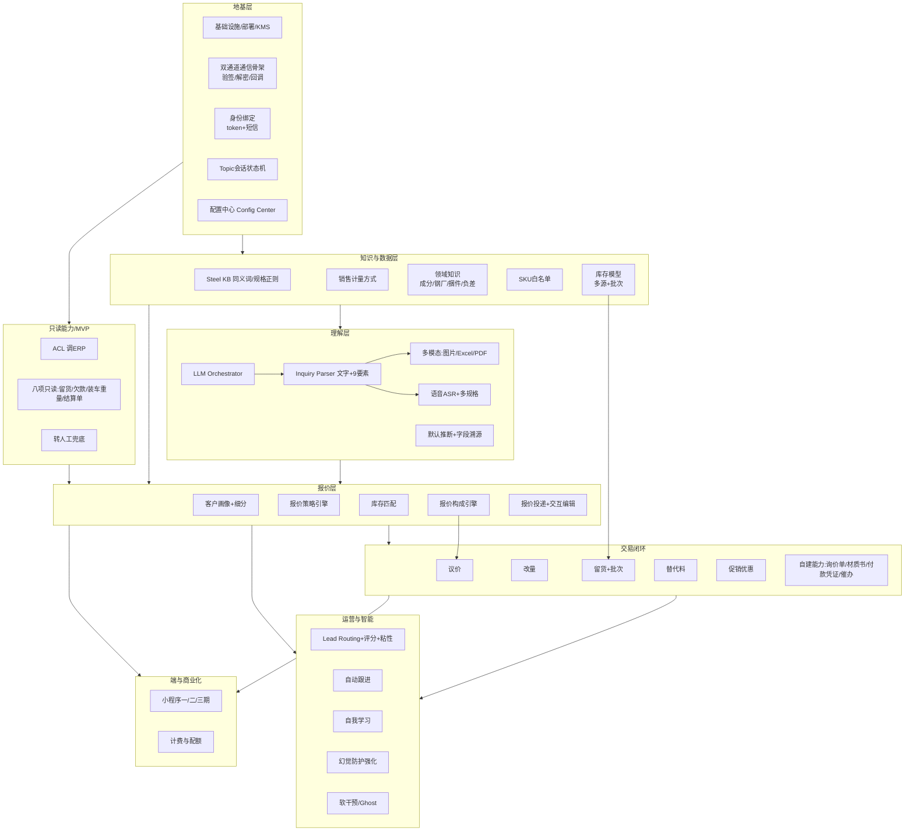

# 实施路线图（Implementation Roadmap）

> 把 59 个里程碑（M1~M59）按**依赖关系 + 业务价值 + 风险**重排为可执行的实施阶段。
> 里程碑原按需求迭代顺序编号，本路线图按**实施依赖**重组。
> 返回 [总览](../DESIGN.md)。需求溯源见 [`TRACEABILITY.md`](./TRACEABILITY.md)，验收见 [`ACCEPTANCE.md`](./ACCEPTANCE.md)。
>
> **说明**：不估算日历时间（不适合自主开发节奏）。以**依赖、难度、风险、前置条件**刻画。每阶段有明确退出标准（关联 UAT）。

---

## 1. 排期三原则

1. **依赖优先**：地基（通信/身份/配置/知识/数据）必须先于上层（报价/议价/交易）。
2. **价值前置**：尽早产出可用价值——MVP 让客户能"自助查询 + 询价转销售"即有价值，不必等全功能。
3. **风险前移**：外部依赖（业务系统 webhook、微信资质、支付资质）和高不确定项（多模态准确率、防幻觉）尽早验证。

---

## 2. 外部前置条件（卡脖子项，需尽早落实）

> 这些不是里程碑，但会阻塞对应阶段。建议立即启动申请/协调。

| 前置条件 | 阻塞 | 状态 |
|---|---|---|
| 企业微信：自建应用 + 微信客服开通 | Phase 0 通信 | 待办 |
| 公网域名 + ICP 备案 + HTTPS 证书 | Phase 0 回调 | 待办 |
| **业务系统 Inbound Webhook 开发配合**（quote/settlement/payment/shipment + deposit） | Phase 1/3 异步流程 | 需方已确认可配合（v15）|
| **业务 API 联调**（留货/欠款/装车重量/结算单 PDF） | Phase 1 只读能力 | 接口契约待定 |
| DeepSeek + 通义千问（Qwen-VL）账号 + 配额 | Phase 2 报价/解析 | 待办 |
| 科大讯飞 ASR 账号 + 钢铁热词 | Phase 5 语音 | 待办 |
| KMS / Secrets Manager | Phase 0 密钥 | 待办 |
| 微信支付商户号 + 微信开放平台账号（unionid） | Phase 6 小程序 | 待办 |
| 各企业初始配置默认值（计量/定金/策略/费率…🔧项） | Phase 2+ 各模块 | 实施时与企业确认 |

---

## 3. 依赖分层（架构地基 → 上层能力）



---

## 4. 实施阶段（Phase 0 → 6）

### Phase 0 · 地基（最高优先，全局依赖）

| 里程碑（原编号映射） | 内容 |
|---|---|
| M1~M2 | 基础设施、部署、KMS、双通道通信骨架（验签/解密/URL校验/access_token） |
| M3 | 身份绑定（一次性 token + 手机号短信） |
| M6（部分） | Topic + Task 会话状态机 |
| M42 | 配置中心 Config Center（多租户骨架 + 热加载） |

- **难度**：中。通信加解密、access_token 分布式锁是要点。
- **风险**：企业微信资质、域名备案（外部前置）。
- **退出标准**：自建应用能收发消息（echo）；微信客服通道打通；绑定可用；配置中心可读写。

### Phase 1 · MVP（只读查询 + 询价转人工，最快产生价值）

| 里程碑 | 内容 |
|---|---|
| M4 | ACL 调 ERP（只读） |
| M6~M16（只读部分） | 八项能力的只读类：查留货订单/查欠款/查装车重量/查结算单 PDF |
| M5 | LLM Orchestrator（文字意图识别，基础） |
| M36（基础） | 转人工兜底（无库存/未定价/复杂 → 转销售） |
| M45（部分） | 自建询价单 + 发货催办（最简） |

- **目标**：跑通「客户发消息 → 查数据/转人工 → 回消息」。**这就是 v1 的原始需求闭环**。
- **难度**：中低。重在 ACL 字段映射 + 业务 API 联调。
- **风险**：业务 API 接口契约。
- **退出标准**：UAT-20（八项只读能力逐项）+ UAT-12（转人工）通过；客户能自助查 4 类数据，复杂询价转销售。

### Phase 2 · 报价核心（自动/辅助报价）

| 里程碑 | 内容 |
|---|---|
| M? Steel KB | 同义词/规格正则/理论重量（B1） |
| M53 | 销售计量方式（六种 + 品类配置） |
| M54 | 领域知识（成分/钢厂/捆件/负差） |
| M44（SKU白名单） | 可机器报价 SKU 白名单 |
| M5/C2/C3 | Inquiry Parser 文字 + 9 要素 + 默认推断 + 字段溯源 |
| M21~M23 | 客户画像 + 细分 + 库存匹配 |
| M24~M25 | 报价策略引擎 + 三档协作 |
| M48 | 报价构成引擎（一票两票/加工/运费/贴现/资金成本/全成本红线） |
| M46/M49 | 报价投递三件套 + 交互式编辑 + 品类要素配置 |
| M40（幻觉防护基础） | LLM 占位符 + DLP 数字扫描 |

- **目标**：文字单规格询价 → 自动/辅助报价（含完整价格构成 + 计量方式）→ 投递 → 客户确认。
- **难度**：高。报价构成、策略、全成本红线、防幻觉是核心。
- **风险**：报价计算正确性（财务核对）、防幻觉（强制验证）。
- **退出标准**：UAT-01（文字询价→报价→下单）、UAT-03（口语化）、UAT-17（一票两票+结算）、UAT-18（计量方式）、UAT-15（防幻觉）通过；§1 报价 KPI 达标。

### Phase 3 · 交易闭环（议价/改量/留货/替代料/促销）

| 里程碑 | 内容 |
|---|---|
| M29~M34 | 议价（状态机/让步曲线/整单优化/议价LLM/话术/灰度） |
| M35 | 改量（生命周期版本化 + 五档决策） |
| M41 + M58 | 留货下单 + 批次库存 |
| M37 + M55 | 替代料（含三类 + 成分标准兼容） |
| M56 | 促销优惠引擎 |
| M45（完整） | 自建能力层：材质书 PDF + 付款凭证 OCR + 询价异步报价 |
| 业务 webhook | quote.ready/settlement/payment/shipment + deposit |

- **目标**：完整成交闭环（询价→报价→议价→改量→留货付定金→转单；替代料/促销）。
- **难度**：高。议价博弈、留货库存独占、批次、自建能力 + ERP 同步。
- **风险**：业务系统 webhook 配合（关键）；库存超卖；议价让步预算/红线。
- **退出标准**：UAT-06/07/08/09/10/11（异步报价/议价/促销叠加/改量/替代/留货）通过；防错红线（赔本/超卖/误替代）0 发生。

### Phase 4 · 销售运营与智能

| 里程碑 | 内容 |
|---|---|
| M36 + M43 + M55 | Lead Routing + 销售评分 + 状态 + 粘性 + 客户细分 + 竞品可信度 |
| M44 | 销售级别 + 配额 + 新人保底 |
| M21/M26（软干预） | Ghost Score + 5 层软干预 |
| M59 | 自动跟进（自适应频率） |
| M38~M39 | 自我学习（Pattern Miner/Effectiveness/Self-tuning/Drift） |
| M40（完整） | 幻觉防护层完整 |

- **目标**：销售竞争分配、白嫖管理、自动跟进、系统自我学习（不幻觉）。
- **难度**：高。自我学习的 5 道防护 + 学习/决策解耦是难点。
- **风险**：学习污染、Drift；马太效应；自动跟进骚扰。
- **退出标准**：UAT-13/14/19（竞争分配/软干预/自动跟进）+ UAT-15（学习+防幻觉）通过；学习冷启动/Drift 防护验证。

### Phase 5 · 多模态增强（可与 Phase 2/3 并行）

| 里程碑 | 内容 |
|---|---|
| M? | Inquiry Parser 图片/Excel/PDF（Qwen-VL） |
| M57 | 语音输入（科大讯飞 ASR） |
| M56（多规格反馈） | 多规格组合询价 + 库存即时反馈 |
| v25 | 语音 + 多规格交叉（共享要素 + 强制逐规格回显） |

- **目标**：客户用图片/Excel/PDF/语音 + 多规格发起询价。
- **难度**：高（识别准确率）。**可与 Phase 2/3 并行**（共享 Inquiry Parser 框架）。
- **风险**：多模态准确率、ASR 钢铁黑话、错误率叠加。
- **退出标准**：UAT-02/04/05（图片Excel PDF/多规格库存/语音）通过；§1 识别 KPI 达标。

### 小程序端线（并行轨 · 跟随后端能力解锁，非线性"最后阶段"）

> ⚠️ 重要澄清（消除与 v18 小程序分期的冲突）：
> 小程序**不是排在 Phase 4/5 之后的"第 6 阶段"**，而是一条**独立并行端线**。它的每一期能否启动，取决于**对应后端能力（Phase 2/3/5）是否就绪**——"价值高"不等于"能最先做"，小程序一期价值最高但被报价/留货后端依赖卡着。
>
> 统一原则：**小程序任一功能 = 对应后端就绪 + 端开发**；微信对话主线（Phase 0~3）始终是基础与兜底，小程序是其"重交互增强端"。

**小程序各期 ↔ 后端前置 对齐表**

| 小程序期（v18 产品价值排序） | 功能 | 后端前置 | 最早可启动 | 资质前置 |
|---|---|---|---|---|
| MVP 阶段 | **不做小程序** | — | Phase 0~1（用微信对话） | — |
| 小程序一期（最高频，价值最大） | 报价详情编辑 + 留货下单 + 微信支付定金 | **Phase 2 报价后端 + Phase 3 留货后端** | **Phase 3 完成后** | 微信支付商户号 |
| 小程序二期 | 查订单/磅单/材质书/对账 + 订阅消息 | Phase 1 只读 + Phase 3 自建材质书/对账 | 后端就绪即可（建议紧随一期） | 订阅消息模板 |
| 小程序三期 | 小程序内发起询价 + 我的中心 + 白标可选 | Phase 2/5 询价解析（多模态） | **Phase 5 完成后** | — |

> 解读：
> - v18 把"报价编辑+留货"放小程序一期是因为**对小程序用户价值最高**——保留此排序。
> - 但它依赖报价(Phase 2)+留货(Phase 3)后端，所以**小程序整体启动点 = Phase 3 完成后**，作为并行端线推进，不必等 Phase 4/5。
> - 与"MVP 不做小程序、先跑通微信对话"完全一致——MVP 用对话，小程序在 Phase 3 后并行启动。

- **共同前置（外部）**：微信支付商户号 + 微信开放平台账号（unionid）+ 交易类目审核 → **立即申请**（有周期，否则卡小程序一期）。
- **难度**：高。unionid 身份打通、微信支付分账、多端一致（BFF 复用后端）。
- **退出标准**：UAT-16（投递双路径）+ 小程序端报价/留货/支付/查单据通过。

### SaaS 计费与配额（贯穿，随用量启用，不依赖小程序）

| 里程碑 | 内容 |
|---|---|
| M47 | SaaS 套餐 + Qwen-VL/讯飞 配额 + 文件保留计费 + 用量计量 + 账单 + 配额告警 |

- **随用量产生即启用**：Phase 2 起有 LLM 用量、Phase 5 起有 ASR 用量、文件保留随存储产生。
- 商业化结算（微信支付分账）与小程序一期同期。

### 全程贯穿（不单列阶段）

| 项 | 说明 |
|---|---|
| 安全/DLP/审计 | 每阶段同步建设（密钥、越权、脱敏、审计） |
| 可观测 | 指标/告警/日志随各模块上线 |
| 验收 | 每阶段按对应 UAT + 防错红线 |
| 灰度 | 内部销售 → 部分客户 → 全量 |

---

## 5. 关键路径与并行机会

**关键路径（串行，决定整体节奏）：**
```
Phase 0 地基 → Phase 1 MVP（八项只读+转人工）→ Phase 2 报价核心 → Phase 3 交易闭环 → Phase 4 运营智能
                                                          │
                                  并行端线/支线（依赖对应后端就绪后启动）：
                                  ├─ 多模态轨（依赖 Phase 2 Parser）：图片/Excel/PDF/语音/多规格
                                  └─ 小程序端线：一期(报价编辑+留货+支付,依赖P2+P3)
                                                 二期(查单据+订阅,依赖P1+P3)
                                                 三期(询价发起,依赖P2/P5)
```

**可并行的支线：**
- **Phase 5 多模态**：Inquiry Parser 框架在 Phase 2 建好后，图片/Excel/PDF/语音可独立并行（不阻塞报价主线）
- **小程序端线**：**不是 Phase 6 线性最后阶段**，而是并行端线。报价/留货后端（Phase 2/3）就绪后即可启动小程序一期，与 Phase 4/5 并行（BFF 复用后端）。详见上文「小程序端线」对齐表。
- **领域知识/计量（B1~B3）**：Phase 2 前可由业务部并行整理数据（KB/重量表/计量配置）
- **配置中心（M42）**：Phase 0 建骨架，各模块配置项随对应阶段并行接入

**最大外部依赖（决定 Phase 1/3 能否推进）：**
- 业务 API 联调（Phase 1）
- 业务系统 Inbound Webhook（Phase 3 异步流程）
→ 建议**立即与业务系统团队确认接口契约和 webhook 排期**。

---

## 6. 阶段价值递进（让需求方看到效果节奏）

| 阶段 | 客户/销售能看到的效果 |
|---|---|
| Phase 1 MVP | 客户微信里自助查留货/欠款/装车重量/结算单；复杂询价自动转销售 |
| Phase 2 | 文字询价自动出报价（含一票两票/加工/运费/计量），销售一键确认 |
| Phase 3 | 完整成交：议价、改量、留货付定金、替代料推荐、促销 |
| Phase 4 | 销售智能分配、白嫖管理、自动跟进、系统越用越准（不乱报价） |
| Phase 5 | 图片/Excel/PDF/语音 + 一次多规格询价 |
| 小程序端线（P3 后并行启动） | 小程序流畅编辑报价/留货/支付/查单据；SaaS 计费 |

---

## 7. 风险登记（Top 风险与应对）

| 风险 | 阶段 | 应对 |
|---|---|---|
| 业务系统 webhook/API 配合延迟 | 1/3 | 立即确认契约；Phase 1 先用只读 + 轮询过渡 |
| 报价计算错/防幻觉不到位 | 2 | 财务核对 + 全成本红线 + 占位符强制 + 灰度 |
| 多模态/语音准确率不足 | 5 | 强制回显确认 + KB 校正 + 转人工兜底；并行不阻塞主线 |
| 库存超卖/批次错 | 3 | 分布式锁 + ERP 分钟级对账 + 批次锁定 |
| 微信支付/小程序资质审核 | 6 | 提前申请；H5 降级；对话式始终可用 |
| 自我学习污染/Drift | 4 | 冷启动60 + 5道防护 + Drift监控 + 不学习白名单 |
| 配置项初始默认值缺失 | 2+ | 实施前与各企业确认 🔧 项 |

---

## 8. 建议的启动动作（立即可做，不依赖开发）

1. 落实外部前置（§2）：企业微信资质、域名备案、业务 API 契约、webhook 排期、LLM/讯飞账号、微信支付/开放平台账号申请。
2. 业务部并行整理基础数据：Steel KB 词典、理论/抄牌重量表、计量方式品类矩阵、SKU 白名单、定金/费率/策略默认值。
3. 与业务系统团队敲定 8 项能力的 API 契约 + 4 个自建能力的数据边界 + Inbound Webhook 事件格式。
4. 确认各 🔧 可配置项的企业初始默认值（见 TRACEABILITY.md 标记）。
5. 按 Phase 0 → 1 启动开发；Phase 5 多模态、Phase 6 小程序在主线推进中并行排入。
